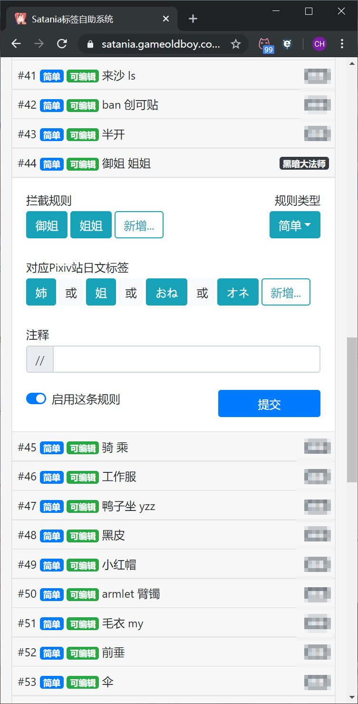
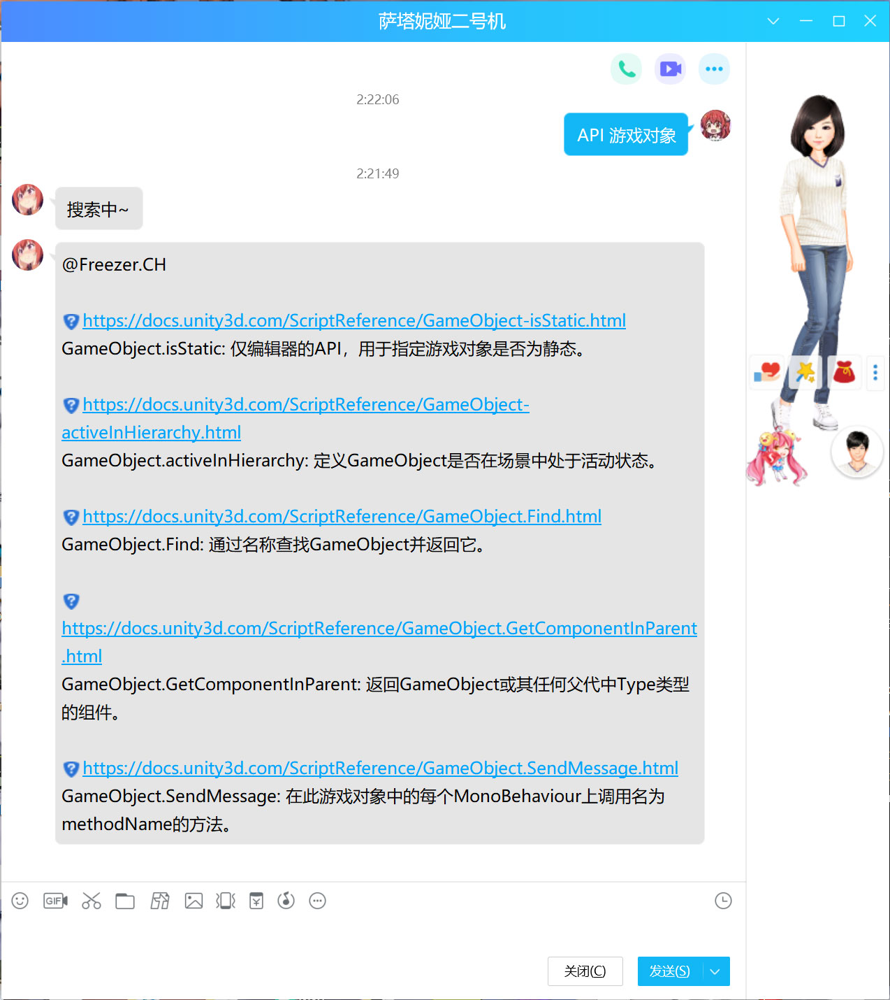
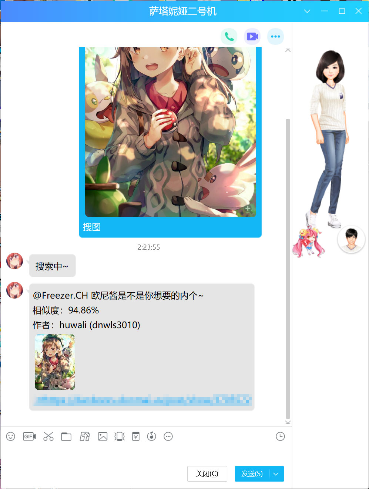
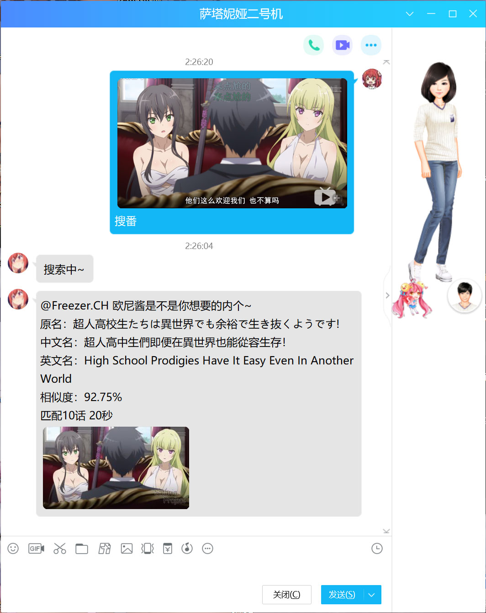

# 萨塔妮娅 Project 3.0
QQ机器人

## 包含功能：

* 色图机器人
    
    

* 色图标签Web服务

     
    

* Unity文档查询

    

* 以图搜图（插画）

    

* 以图搜番

    

* 智能聊天机器人（腾讯AI开放平台）

    

## 库与框架
* [QQLight](https://www.52chat.cc/) —— QQ宿主
* [QQLight WebSocket插件](https://github.com/Chocolatl/qqlight-websocket)
* [Knex.js](http://knexjs.org/) —— ORM框架
* [Express](https://expressjs.com/) —— Web服务框架
* [Puppeteer](https://github.com/puppeteer/puppeteer) —— 无头Chrome Node.js API
* [sharp](https://sharp.pixelplumbing.com/) —— 高性能 Node.js 图形处理库
* [gif-frames](https://github.com/benwiley4000/gif-frames) —— 展开GIF帧库

## 接入的API
* [pixiv-app-api](https://github.com/akameco/pixiv-app-api) —— Pixiv API
* [SauceNao](https://saucenao.com/) —— 以图搜图
* [trace.moe](https://trace.moe/) —— 以图搜番
* [智能闲聊](https://ai.qq.com/product/nlpchat.shtml) —— 腾讯AI开放平台

## 特别感谢
* <a href="https://github.com/KumoKyaku"> 云却</a>
* 二次元与黑科技、U3D & MMD 俱乐部的所有成员