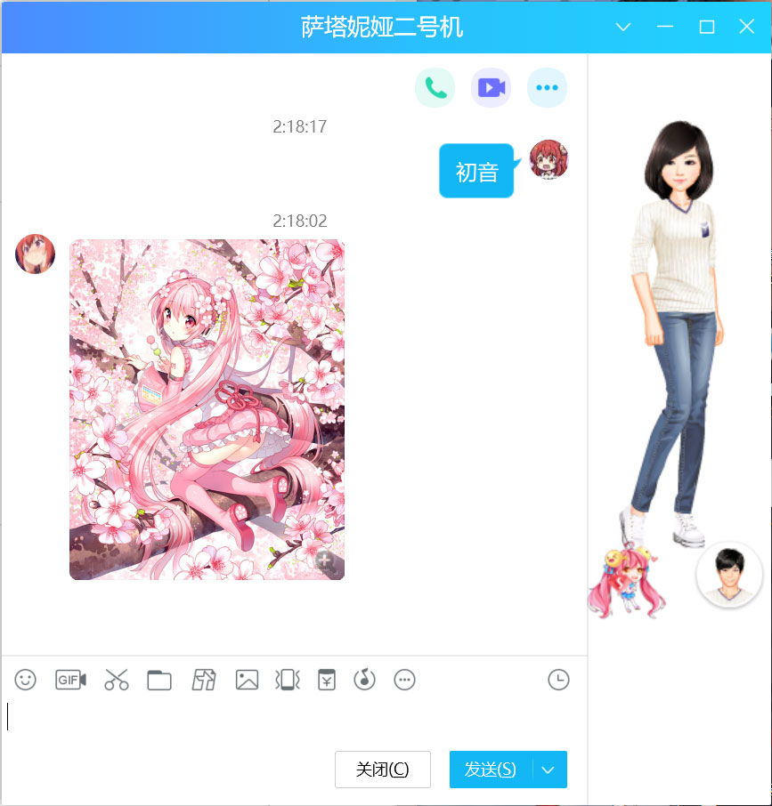
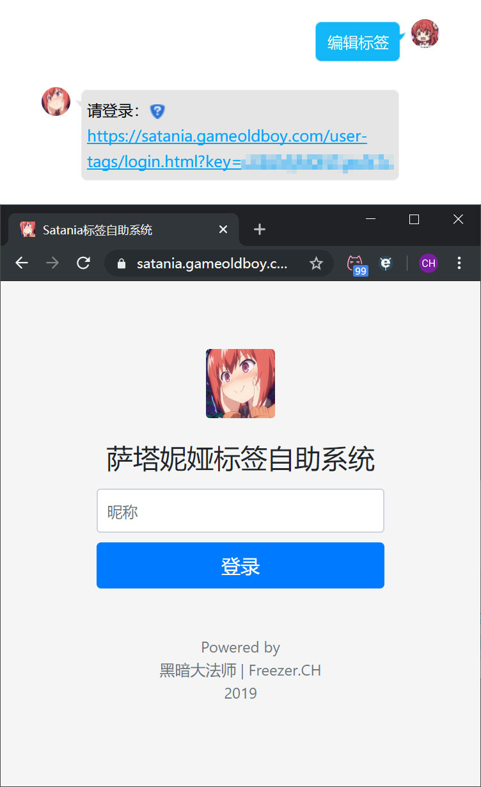

# 萨塔妮娅 Project 3.0
QQ机器人

## 包含功能：

* 色图机器人
    
    

* 色图标签Web服务

    <br>
    

* Unity文档查询

    

* 以图搜图（插画）

    

* 以图搜番

    

* 智能聊天机器人（腾讯AI开放平台）

    

## Configuration
* secret.json
```
你需要将secret.sample.json重命名为secret.json，并填入相关api key或密码使应用可正常运行。

字段说明：
wsHost                  qq宿主websocket地址
wsPort                  qq宿主websocket端口
wsPath                  qq宿主websocket路径
SauceNAO_API_KEY        SauceNAO API密钥
targetQQ                目标qq号，用于机器人被at依据
tempPath                qq宿主临时文件夹
emoticonsPath           表情图片路径
AI_QQ_APPID             腾讯智能闲聊应用ID
AI_QQ_APPKEY            腾讯智能闲聊应用密钥
PixivAPIAccounts        拉取Pixiv时提供的Pixiv用户名密码，可以多个，因pixiv拉取限制，单个账号被限制后以轮换的方式保证事务正常运行
chromiumUserData        chromium用户临时文件路径
mysqlHost               MySQL服务地址
mysqlPort               MySQL服务端口
mysqlUser               MySQL数据库用户名
mysqlPassword           MySQL数据库密码
mysqlDatabase           MySQL数据库名称
httpHost                网页服务监听地址（本地）
publicDomainName        公共域名，用于标签编辑系统所发送的URL前缀
imagePath               图片处理的临时文件夹
imageRootUrl            网页服务图片URL前缀
serviceRootUrl          网页服务URL前缀
```

## Usage
* app.js

```
本应用主脚本。

例子：
$ node app.js
```
* gfw_outside_service.js
```
墙外服务脚本。例如Pixiv、谷歌翻译等。特别注意的是，需要和app.js配对运行，如果非本地运行此服务，需要修改secret.json中相关字段

例子：
$ node gfw_outside_service.js
```
* Pixiv_database.js
```
第一次使用萨塔妮娅需要先运行此脚本创建表结构，此脚本会在数据库中自动创建名称为illusts、recovery_work的表

Usage:
Pixiv_database <keywords> <name> [<years>] [<months>] [<days>]

keywords            每个关键词用逗号隔开，如果关键词使用特殊字符，请使用双引号
name                事务的名称。可能由网络问题、用户强行停止等原因导致事务中断， 使用此名称可以恢复同名事务进度
year                拉取的目标年份，默认为10年
month               拉取的目标月份
day                 拉取的目标日期

例子：
$ node Pixiv_database.js "レム(リゼロ),初音ミク,サターニャ,胡桃沢=サタニキア=マクドウェル,時崎狂三,イリヤ,ララフェル,Lalafell,拉拉菲尔" char 0 0 7
```

## Pixiv Database
* illusts —— 应用自动管理，无需手动编辑
```
拉取到的色图信息保存在此表

id                  对应pixiv作品id
title               色图标题
image_url           色图url
user_id             作者id
rating              分级
tags                本图片所有标签，以逗号分割
create_date         作品创建日期
page_count          作品包含页数
width               图片宽
height              图片高
total_view          作品观看总数
total_bookmarks     作品收藏总数

例子：
id: 79185892
title: MIKU 防毒面具
image_url: https://i.pximg.net/img-master/img/2020/01/31/00/3...
user_id: 7210261
rating: safe
tags: 女の子,VOCALOID,初音ミク,miku,VOCALOID1000users入り,マスク
create_date: 2020-01-31 00:06:18
page_count: 1
width: 1131
height: 1600
total_view: 22540
total_bookmarks: 5253
```
* inside_tags
```
每日自动向Pixiv拉取色图的内置（非面向用户）标签，特别注意第一次运行需要配置此表

id                  自增id
type                sex|char
tag                 要搜索的日文标签
comment             注释

例子：
id: 1
type: sex
tag: 水着
comment: 泳衣
```
* recovery_work —— 拉取事务恢复记录表。应用自动管理，无需手动编辑
* rule_list
```
这里规定了qq号、qq群的黑白名单规则

id                  自增id
type                qq|group
name                qq号或群号
rule                white|block|NULL

例子：
id: 1
type: group
name: 10086
rule: block
本条规则会屏蔽群号10086的色图功能
```
* seen_list —— 各个qq群已看过的色图表（防止qq群发重复的图）。应用自动管理，无需手动编辑
* users —— 用户表。应用自动管理，无需手动编辑
* user_tags —— 标签自助系统的用户标签信息保存在此表。应用自动管理，无需手动编辑

## 库与框架
* [QQLight](https://www.52chat.cc/) —— QQ宿主
* [QQLight WebSocket插件](https://github.com/Chocolatl/qqlight-websocket)
* [Knex.js](http://knexjs.org/) —— ORM框架
* [Express](https://expressjs.com/) —— Web服务框架
* [Puppeteer](https://github.com/puppeteer/puppeteer) —— 无头Chrome Node.js API
* [sharp](https://sharp.pixelplumbing.com/) —— 高性能 Node.js 图形处理库
* [gif-frames](https://github.com/benwiley4000/gif-frames) —— 展开GIF帧库

## 接入的API
* [pixiv-app-api](https://github.com/akameco/pixiv-app-api) —— Pixiv API
* [SauceNao](https://saucenao.com/) —— 以图搜图
* [trace.moe](https://trace.moe/) —— 以图搜番
* [智能闲聊](https://ai.qq.com/product/nlpchat.shtml) —— 腾讯AI开放平台

## 特别感谢
* <a href="https://github.com/KumoKyaku"> 云却</a>
* 二次元与黑科技、U3D & MMD 俱乐部的所有成员